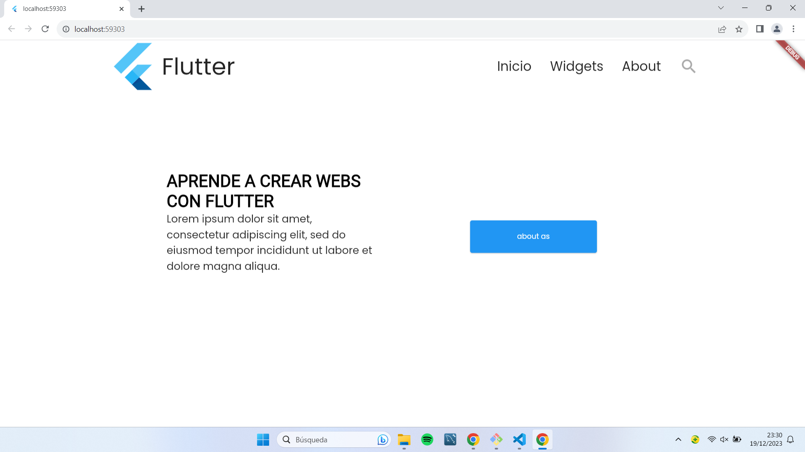
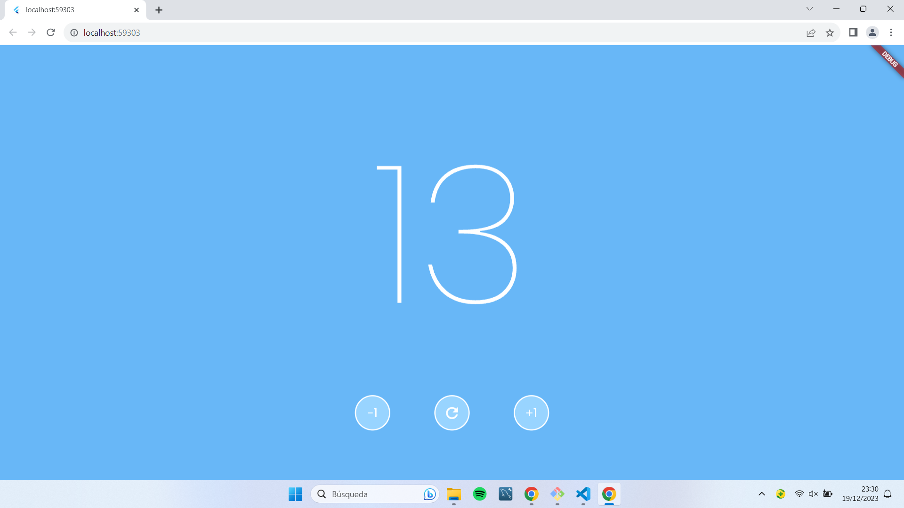

# Ejercicio 1

Contenido del ejercicio 1.

# Ejercicio 2

Contenido del ejercicio 2.

# main.dart EXPLICACION:

# Resumen de la Aplicación Flutter

El siguiente código en Flutter representa una aplicación móvil básica con una estructura de interfaz de usuario (UI) que utiliza varios widgets. Aquí hay un resumen de lo que hace:

## Configuración Inicial

La función `main` inicializa la aplicación Flutter y ejecuta la clase `MyApp`.

## Clase MyApp

`MyApp` es una clase que hereda de `StatelessWidget` y define la estructura general de la aplicación.

## Tema y Fuentes

Se utiliza el paquete `google_fonts` para aplicar el tema de texto con la fuente "Poppins" a través de `GoogleFonts.poppinsTextTheme()`.

## Estructura de la Interfaz

La aplicación utiliza un `Scaffold` como estructura básica, con un fondo blanco (`backgroundColor: Colors.white`). El contenido principal está envuelto en un `SingleChildScrollView` para permitir el desplazamiento si el contenido es demasiado grande para caber en la pantalla.

## Columnas y Filas

Se utilizan varios widgets de tipo `Column` y `Row` para organizar y posicionar otros widgets en la interfaz de usuario de manera vertical y horizontal.

## Widgets Personalizados

Se utilizan widgets personalizados como `MyWidget`, `MyWidget2`, `MyWidget3`, y `MyWidget4`. Estos widgets probablemente se definen en archivos separados dentro del directorio 'widgets' (por ejemplo, widget1.dart, widget2.dart, etc.).

## Alineación y Espaciado

Se establecen propiedades como `mainAxisAlignment` y `crossAxisAlignment` para alinear y distribuir los widgets de manera adecuada en la interfaz.

## Dimensiones y Separadores

Se utilizan `SizedBox` para agregar espacios específicos entre algunos widgets, y se ajustan dimensiones utilizando `MediaQuery` para aprovechar el tamaño de la pantalla.

En resumen, el código crea una interfaz de usuario estructurada y alineada vertical y horizontalmente, utiliza fuentes personalizadas y se asegura de que el contenido sea desplazable en caso de que no quepa en la pantalla. Los detalles específicos de la apariencia y el comportamiento dependen de la implementación de los widgets personalizados (`MyWidget`, `MyWidget2`, etc.) que no están proporcionados en el código dado.

# widget1.dart EXPLICACION:

# Explicación del Widget MyWidget

El código proporcionado implementa el widget `MyWidget` en Flutter, que representa una parte de la interfaz de usuario (UI) de la aplicación. A continuación, se explica cada parte del código:

## Clase MyWidget

Esta clase hereda de `StatelessWidget` y es responsable de construir la interfaz para la sección específica que representa.

## Método `build`

El método `build` es un método obligatorio en un widget Flutter y se encarga de retornar la jerarquía de widgets que conforman el widget en sí.

## Widget Principal - `Row`

El widget principal es un `Row`, que organiza sus elementos secundarios en una fila horizontal.

### Primera Fila en el `Row`

Esta fila contiene un `FlutterLogo` (el logotipo de Flutter) y un `Text` con el texto "Flutter". Se utiliza un `SizedBox` para agregar un espacio de 5 unidades entre el logo y el texto.

### Segundo Elemento en el `Row`

Un `SizedBox` con un ancho de 500 unidades, proporcionando un espacio considerable entre las dos partes del `Row`.

### Tercera Fila en el `Row`

Esta fila contiene otro `Row` con una serie de elementos, incluyendo texto y un icono de búsqueda. Los elementos están organizados horizontalmente (`MainAxisAlignment.spaceEvenly`), y el icono de búsqueda está coloreado con un tono gris específico.

#### `Text` Widgets

Se utilizan varios widgets `Text` para mostrar texto como "Inicio", "Widgets" y "About". Cada uno tiene un estilo de fuente específico con un tamaño de 25 unidades.

#### `Icon` Widget

Se utiliza un widget `Icon` para mostrar un icono de búsqueda. Este icono está coloreado con un tono gris específico y tiene un tamaño de 36 unidades.

En resumen, `MyWidget` representa una sección de la interfaz de usuario con el logotipo de Flutter, un título, y una barra de navegación con enlaces "Inicio", "Widgets" y "About", además de un icono de búsqueda. El diseño utiliza `Row` y `Column` para organizar los elementos de manera adecuada en la interfaz.

# widget2.dart EXPLICACION:

# Explicación de MyWidget2 y MyWidget3

## MyWidget2

### Clase `MyWidget2`

La clase `MyWidget2` es un widget en Flutter que hereda de `StatelessWidget`. Su función es construir una interfaz de usuario que consiste en un contenedor con dimensiones específicas, que contiene dos bloques de texto.

### Método `build`

El método `build` es obligatorio en un widget Flutter y se encarga de retornar la jerarquía de widgets que constituyen el widget.

### Contenedor Principal

- **Dimensiones:** El contenedor tiene un ancho de 400 unidades y una altura de 250 unidades.

- **Color de Fondo:** El color de fondo del contenedor es blanco (RGB: 255, 255, 255).

### Columna de Texto

- **Texto 1:** Un `Text` con el contenido "APRENDE A CREAR WEBS CON FLUTTER".
  - **Estilo de Texto:** Fuente de 32 unidades, familia de fuente 'Poppins', negrita (font-weight: 700), color negro.

- **Texto 2:** Otro `Text` con un párrafo de Lorem Ipsum.
  - **Estilo de Texto:** Fuente de 20 unidades.

En resumen, `MyWidget2` representa un contenedor con dos bloques de texto, uno con un título grande y otro con un párrafo más pequeño.

## MyWidget3

### Clase `MyWidget3`

La clase `MyWidget3` es otro widget en Flutter que hereda de `StatelessWidget`. Su función es construir un contenedor con un botón elevado en el centro.

### Método `build`

Al igual que en `MyWidget2`, el método `build` retorna la jerarquía de widgets.

### Contenedor Principal

- **Alineación:** El contenedor se centra en la pantalla.

- **Color de Fondo:** El color de fondo del contenedor es blanco (RGB: 255, 255, 255).

- **Dimensiones:** El contenedor tiene un ancho de 400 unidades y una altura de 250 unidades.

### Botón Elevado

- **Estilo de Botón:** Se establece un estilo para el botón, especificando un tamaño mínimo de 250x70 unidades.

- **Texto del Botón:** El botón tiene el texto "about as".

- **Funcionalidad del Botón:** Aunque la función del botón está vacía en el código proporcionado, normalmente se le asignaría una acción específica al ser presionado.

En resumen, `MyWidget3` representa un contenedor centrado con un botón elevado. La función del botón debería ser definida para realizar alguna acción cuando se presiona.

# widget3.dart EXPLICACION:

# Explicación de MyWidget4

La clase `MyWidget4` en Flutter representa un widget que construye una interfaz de usuario (UI) con un fondo azul, números y botones redondos con funcionalidades específicas. A continuación, se detalla cada parte del código:

## Método `build`

Este método es obligatorio en un widget Flutter y se encarga de retornar la jerarquía de widgets que conforman el widget.

## Contenedor Principal

- **Color de Fondo:** El contenedor tiene un fondo azul con el color RGB (104, 183, 247).

- **Dimensiones:** El contenedor ocupa todo el ancho y alto de la pantalla, utilizando `MediaQuery` para obtener el tamaño de la pantalla.

## Columna Principal

- **Alineación y Espaciado:** La columna está centrada verticalmente en la pantalla y contiene dos filas de elementos.

### Primera Fila - Números Grandes

- **Text Widget:** Muestra el número '13' con un estilo específico de fuente utilizando `GoogleFonts.poppins`.

### Segunda Fila - Botones Redondos

- **Método `buildRoundButton`:** Un método que construye un botón redondo con el texto proporcionado.

- **Método `buildReloadButton`:** Un método que construye un botón redondo con un ícono de recarga.

- **Espaciado entre Botones:** `SizedBox` se utiliza para proporcionar espaciado entre los botones.

### Métodos de Construcción de Botones

- **buildRoundButton:** Construye un botón redondo con un texto específico.
  - **Propiedades del Botón:**
    - Ancho y alto de 60 unidades.
    - Borde redondeado.
    - Fondo azul claro.
    - Bordes blancos de 2 unidades de ancho.
  - **Texto:** El texto del botón se proporciona como parámetro.

- **buildReloadButton:** Construye un botón redondo con un ícono de recarga.
  - **Propiedades del Botón:**
    - Ancho y alto de 60 unidades.
    - Borde redondeado.
    - Fondo azul claro.
    - Bordes blancos de 2 unidades de ancho.
  - **Ícono:** Se utiliza el ícono de recarga (`Icons.refresh`) con un tamaño de 30 unidades y color blanco.

En resumen, `MyWidget4` representa una interfaz con un fondo azul, un número grande ('13') y botones redondos con funcionalidades específicas: aumentar, disminuir y recargar. Los estilos y tamaños están diseñados para crear una apariencia atractiva y fácil de usar.

# Contador 

fotos del ejercicio

## Estructura del Código

El código está dividido en dos partes: la definición del widget principal y las funciones relacionadas.

### Widget Principal

El widget principal se llama `MyWidget4`, que es un StatefulWidget. Aquí se inicializa un contador y se construye la interfaz de usuario.

- **Estado del Widget (`_MyWidget4State`):** Gestiona el estado del widget, incluyendo el valor del contador.

- **Método `build`:** Construye la interfaz de usuario utilizando un contenedor con un color de fondo, un texto grande que muestra el valor actual del contador y tres botones distribuidos en una fila.

- **Métodos `sumar`, `restar`, y `empezar`:** Actualizan el estado del contador según sea necesario.

- **Método `buildRoundButton`:** Genera un botón redondo con un texto y una función de devolución de llamada asociada.

- **Método `buildReloadButton`:** Genera un botón redondo con un ícono de recarga para reiniciar el contador.

### Estilo y Diseño

- **Color de Fondo:** Se utiliza un color azul claro para el fondo del contenedor.

- **Fuente y Estilo de Texto:** La fuente utilizada es 'Poppins' de Google Fonts. El texto del contador es grande y blanco.

- **Botones:** Los botones son redondos, con un color de fondo y borde específicos. Los botones de incremento y decremento ejecutan las funciones asociadas (`sumar` y `restar`), mientras que el botón de recarga ejecuta la función `empezar`.

